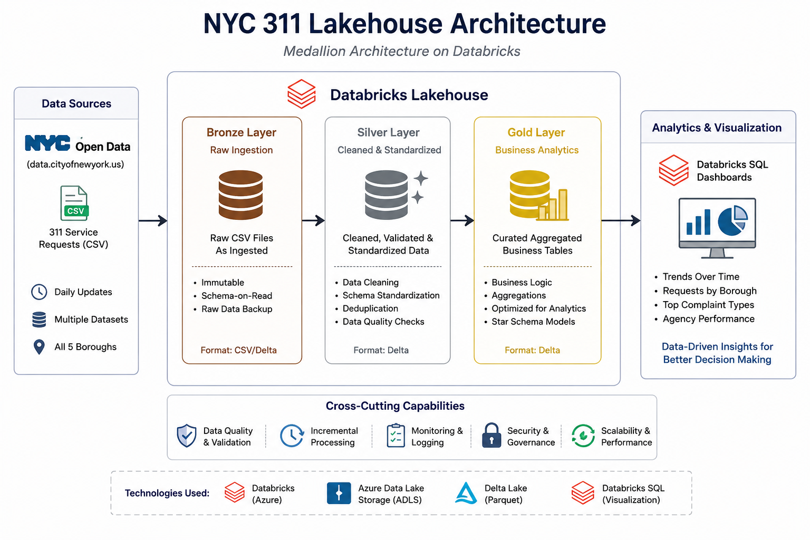
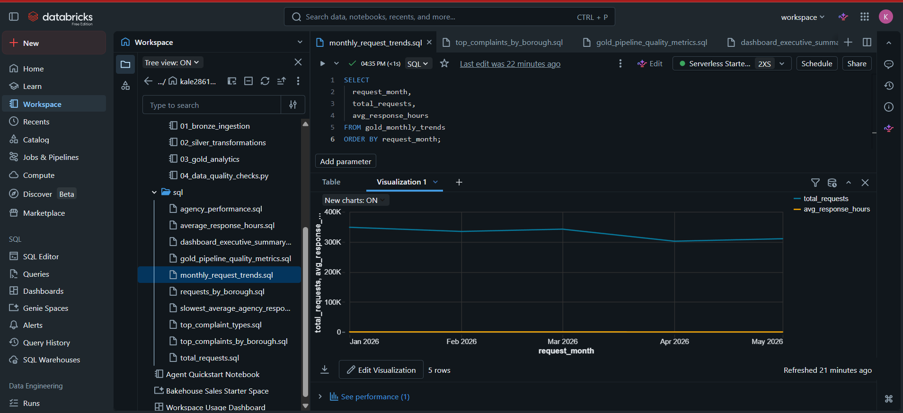
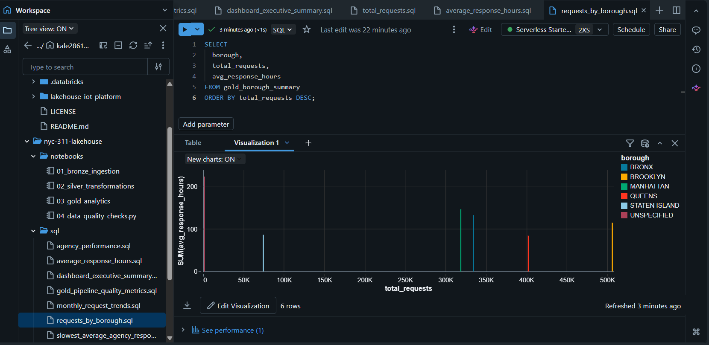
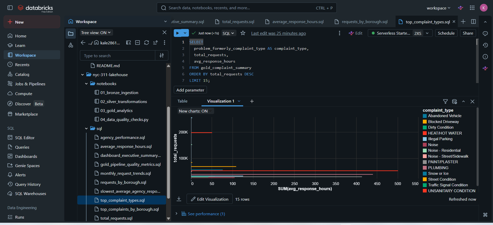

# NYC 311 Lakehouse Analytics Pipeline

## Overview

This project demonstrates the design and implementation of a modern data engineering pipeline using Databricks, PySpark, Delta Lake, and Medallion Architecture principles.

Using NYC 311 Service Request data, the pipeline ingests raw operational data, applies data quality and transformation logic, and produces business-ready analytics tables for reporting and dashboarding.

The project showcases core data engineering concepts including:

* Data ingestion
* Schema standardization
* ETL pipelines
* Delta Lake table management
* Medallion Architecture (Bronze, Silver, Gold)
* Data quality validation
* SQL analytics
* Databricks dashboard development

---

## Business Problem

NYC agencies receive millions of 311 service requests annually covering complaints related to sanitation, noise, transportation, housing, and public services.

The goal of this project is to transform raw service request data into reliable analytics datasets that support:

* Complaint volume monitoring
* Agency performance measurement
* Response time analysis
* Borough-level operational insights
* Trend analysis over time

---

## Architecture



### Data Flow

```text
NYC Open Data
      ↓
 Bronze Layer
 (Raw Ingestion)
      ↓
 Silver Layer
 (Data Cleaning & Standardization)
      ↓
 Gold Layer
 (Business Analytics Tables)
      ↓
 Databricks SQL Dashboard
```

---

## Dashboard Preview


---
### Key Visualizations

#### Monthly Request Trends


#### Requests by Borough


#### Top Complaint Types


#### Agency Performance

---

## Technology Stack

| Technology     | Purpose                        |
| -------------- | ------------------------------ |
| Databricks     | Data engineering platform      |
| PySpark        | Distributed data processing    |
| Delta Lake     | Lakehouse storage layer        |
| SQL            | Analytics and reporting        |
| GitHub         | Version control                |
| Databricks SQL | Dashboarding and visualization |

---

## Medallion Architecture

### Bronze Layer

Raw ingestion layer.

Responsibilities:

* Load source CSV data
* Preserve source fidelity
* Capture ingestion metadata
* Store raw records in Delta format

Output:

```text
bronze_311_requests
```

---

### Silver Layer

Data cleansing and transformation layer.

Responsibilities:

* Standardize column names
* Parse timestamp fields
* Remove duplicate records
* Normalize borough values
* Calculate response times

Derived fields:

```text
response_hours
```

Output:

```text
silver_311_requests
```

---

### Gold Layer

Business-ready analytics layer.

Generated tables:

| Table                          | Purpose                      |
| ------------------------------ | ---------------------------- |
| gold_borough_summary           | Borough performance metrics  |
| gold_agency_performance        | Agency response analysis     |
| gold_complaint_summary         | Complaint volume analysis    |
| gold_monthly_trends            | Time-series trends           |
| gold_borough_complaint_summary | Borough + complaint analysis |
| gold_pipeline_metrics          | Data quality monitoring      |

---

## Data Quality Framework

The pipeline includes automated validation checks to improve reliability.

Checks include:

* Row count validation
* Duplicate detection
* Null identifier validation
* Schema validation

Example:

```python
assert row_count > 0
assert duplicate_count == 0
assert null_request_ids == 0
```

---

## SQL Analytics

Example analyses include:

### Borough Request Volume

```sql
SELECT
    borough,
    total_requests
FROM gold_borough_summary
ORDER BY total_requests DESC;
```

### Agency Response Time Analysis

```sql
SELECT
    agency,
    avg_response_hours
FROM gold_agency_performance
ORDER BY avg_response_hours DESC;
```

### Monthly Trends

```sql
SELECT
    request_month,
    total_requests
FROM gold_monthly_trends
ORDER BY request_month;
```

---

## Project Structure

```text
nyc-311-lakehouse/
│
├── notebooks/
│   ├── 01_bronze_ingestion.py
│   ├── 02_silver_transformations.py
│   ├── 03_gold_analytics.py
│   └── 04_data_quality_checks.py
│
├── sql/
│   ├── borough_summary.sql
│   ├── agency_performance.sql
│   ├── complaint_trends.sql
│   └── monthly_trends.sql
│
├── assets/
│   ├── architecture_diagram.png
│   └── dashboard.png
│
├── README.md
└── requirements.txt
```

---

## Key Outcomes

* Built a complete Medallion Architecture pipeline
* Processed large-scale NYC operational datasets
* Standardized and transformed raw service request data
* Created reusable Delta Lake analytics tables
* Implemented data quality controls
* Developed SQL-based executive dashboards
* Demonstrated modern lakehouse engineering patterns

---

## Future Enhancements

Planned improvements include:

* Incremental ingestion pipelines
* Workflow orchestration
* Machine learning response time prediction
* Automated monitoring and alerting
* Streaming data ingestion

---

## Author

**Sena Kaledzi**

GitHub: https://github.com/kale2861
